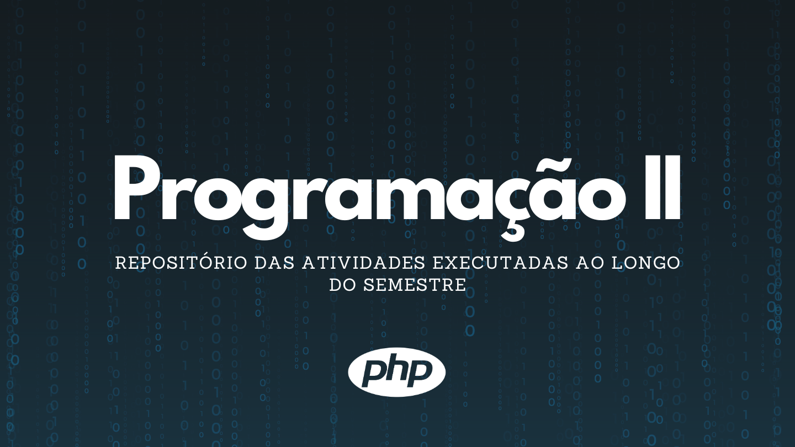

# Programação II

> Matéria feita na faculdade de Ciência da Computação na UNOESC.

### Aprendizados durante o semestre

Este repositório possui todas as atividades e trabalhos executados durante a matéria, veja alguns dos conhecimentos aplicados:

- [x] PHP
- [x] HTML
- [x] CSS
- [x] Funções
- [x] Datas
- [x] Manipulação de strings
- [x] Session
- [x] $_POST
- [x] Banco de dados
